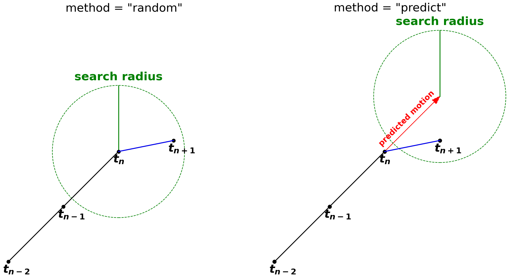
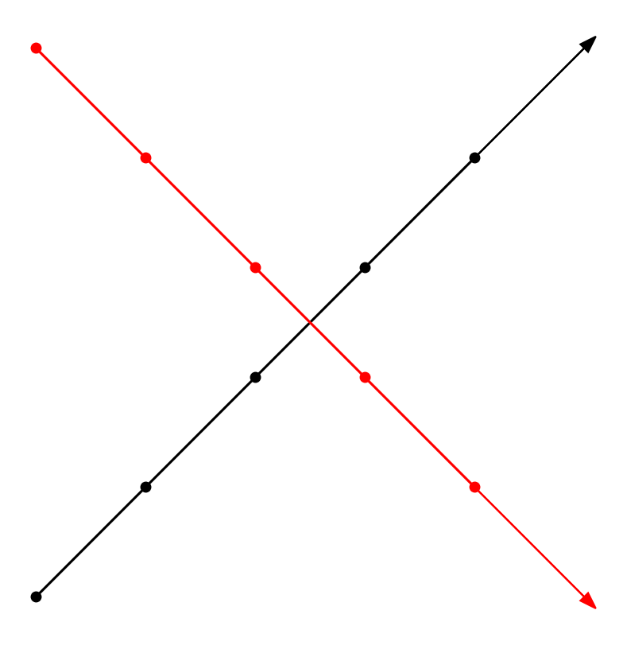
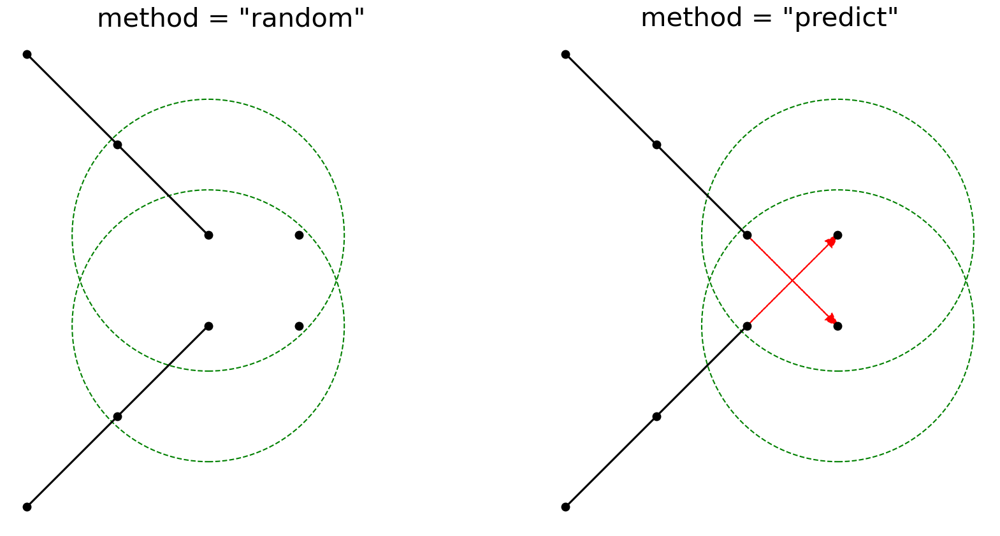
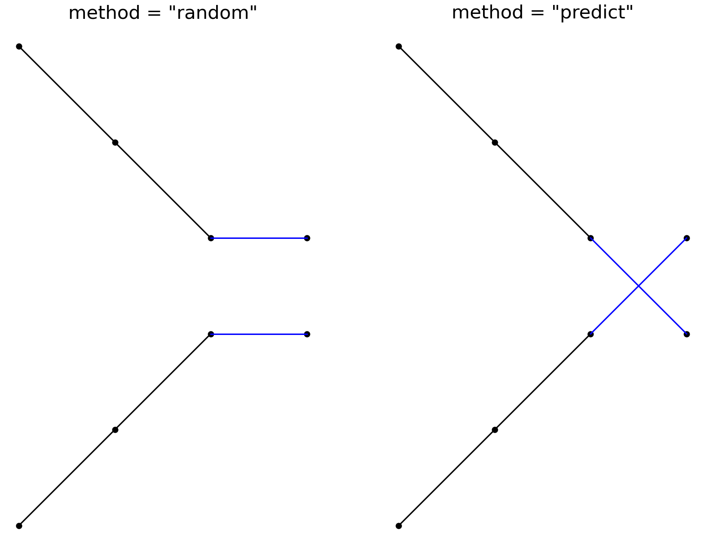

# Tracking Basics

The currently implemented tracking method in *tobac* uses the trackpy library (http://soft-matter.github.io/trackpy). 

This approach only takes the point-like position of the feature, e.g. determined as the weighted mean (see also {doc}`/userguide/feature_detection/index` for information on selecting the appropriate centroid method), into account. Features to link with are looked for in a search radius defined by the parameters v_max or d_max. The position of the center of this search radius is determined by the method keyword. method="random" uses the position of the current feature ($t_i$), while method="predict" makes use of the information from the linked feature in the previous timestep ($t_{i-1}$) to predict the next position. For a simple case the search radii of the two methods look like this:



If there is only one feature in the search radius, the linking can happen immediately. If there are none, the track ends at this timestep. If there are more options, trackpy performs a decision process. Assume there are $N$ features in the current and also $N$ in the next timeframe and they are all within each search radius. This means there are $N!$ options for linking. Each of these options means that $N$ distances between the center of the search radius of a current feature and a feature from the next time frame $\delta_n, n=1, 2, ..., N$ are traveled by the features. Trackpy will calculate the sum of the squared distances

```{math}
\sum_{n=1}^{N} \delta_n^2.
```

For every option the lowest value of this sum is used for linking. As an example, consider these two crossing features:



If the search radius is chosen large enough, each will contain two options, a horizontal and a diagonal feature:



The linking will look differently for both methods in the end. The horizontal features are closer to the current position than the diagonal ones. This is why these are linked by the "random"-method. On the other hand, the diagonal features lie exactly on the guessed positions for the "predict"-method. This means, that the sum of squared distances is 0, and they are the optimal decision for linking in this case:


