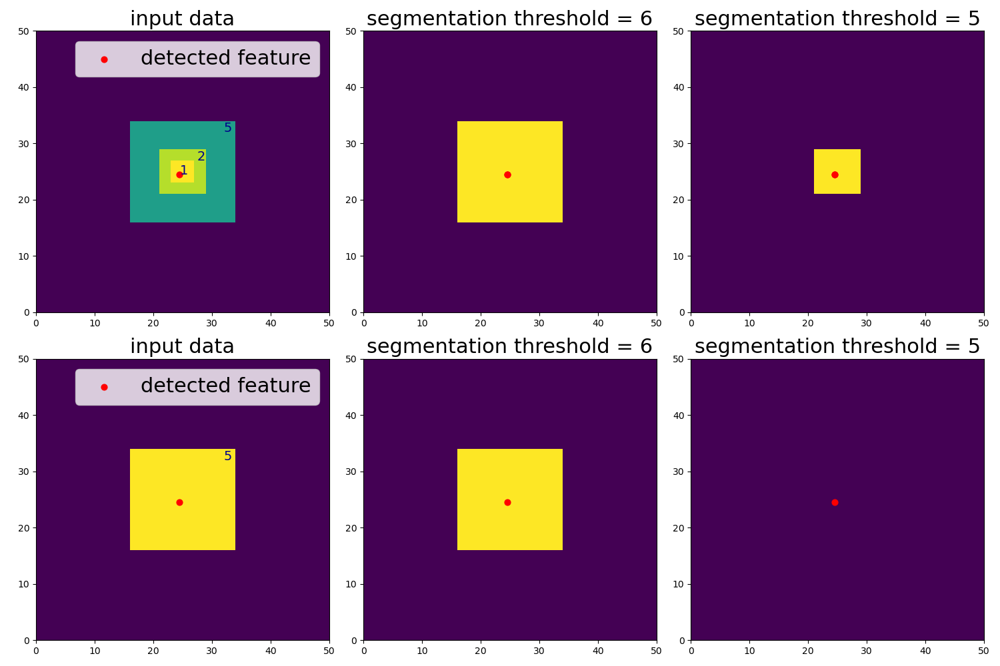
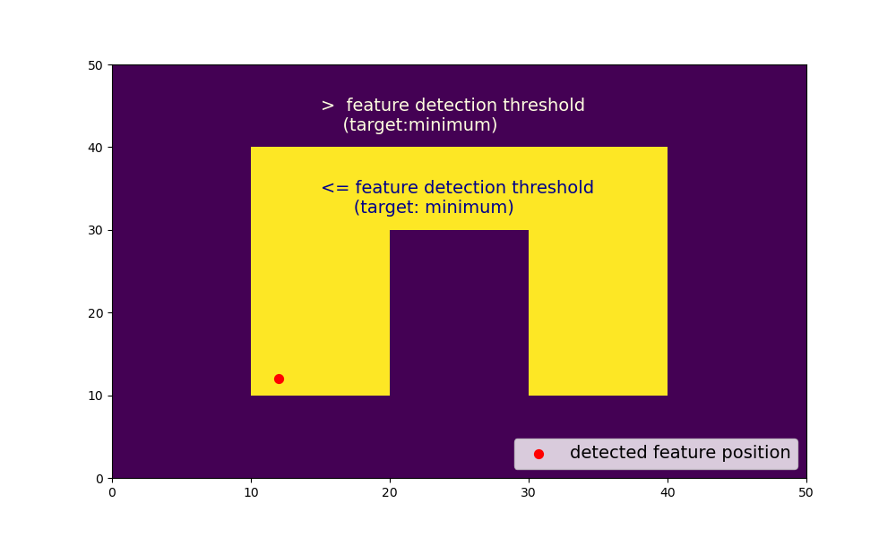

#Features without segmented areas

Not all detected features have a segmented area associated with them. Here, we show two cases in which a detected feature might
not have a segmented area associated with them (meaning that the mask file does not contain the ID of the feature of interest and `ncells` in the segmentation
output dataframe results in 0 grid cells. )

## Case 1: Segmentation threshold

If the segmentation threshold is lower (assuming `target='minimum'`) than the highest threshold specified in the Feature Detection (see {doc}`/userguide/feature_detection/threshold_detection_parameters`) this could leave some features without a segmented area, simply because there are no values to be segmented.

Consider for example the following data with 5 being the highest threshold specified for the Feature Detection (see {doc}`/userguide/feature_detection/index`):  

If the segmentation threshold is larger than 5 (e.g.  `threshold = 6`), the segmented area contains all values <= 5 (still assuming `target='minimum'`), no matter if the detected feature has a threshold lower than 5 (upper panels) or if it is exactly equal to 5 and does not contain any features with lower thresholds inside (lower panels).

If the segmentation threshold is lower than or equal to the highest feature detection threshold (e.g.  `threshold = 5`), features with threshold values lower than 5 still get a segmented area associated with them (upper panels). However, features that are exactly equal to 5 and do not contain any features with lower thresholds inside will not get any segmented area associated with them (lower panels) which results in no values in the mask for this feature  and `ncells=0`.

## Case 2: Feature position

Another reason for features that do not have a segmented area associated with them is the rare but possible case when the feature position is located outside of the threshold area: 

              
In this case, it may help to change the `position_threshold` (see {doc}`/userguide/feature_detection/threshold_detection_parameters`) to  `extreme` instead of  `center`:

