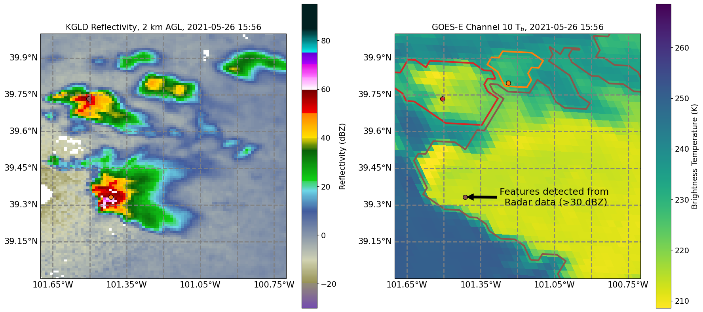

# Track on one dataset, segment on another

*tobac* also has the capability to combine datasets through segmentation, which includes the ability to track on one dataset (e.g., gridded radar data) and run segmentation on a different dataset *on a different grid* (e.g., satellite data).

To do this, users should first run {doc}`/userguide/feature_detection/index` with a dataset that contains latitude and longitude coordinates, such that they appear in the output dataframe from Feature Detection. Next, use {py:func}`tobac.utils.transform_feature_points` to transform the feature dataframe into the new coordinate system. Finally, use the output from {py:func}`tobac.utils.transform_feature_points` to run segmentation with the new data. This can be done with both 2D and 3D feature detection and segmentation.